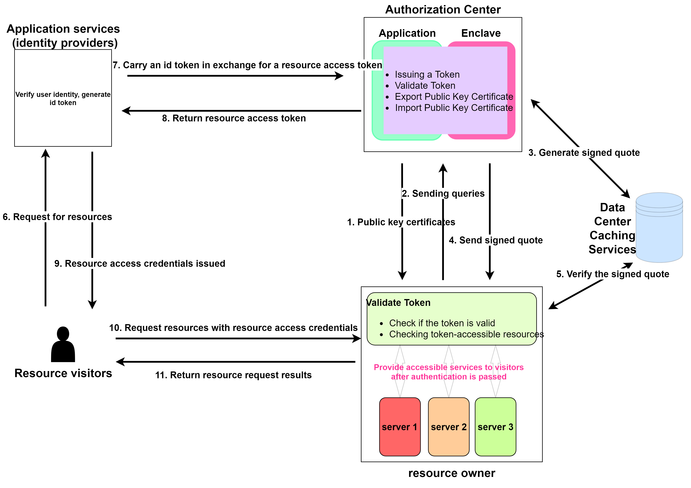

# design document

<p align="center"><a href="./design%20document.md">English</a>|<a href="./design%20document.zh_CN.md">简体中文</a></p>

## Cross Domain Authorization Process




Our project is built based on OIDC process implementation, but it is different from normal OIDC process. In normal OIDC process, Id Token, Access Token are issued together. However, in our scenario, authentication and resource authorization are cross-domain, so the Id Token representing authentication and the Access Token representing resource authorization cannot be issued at the same time. That is to say, the authentication and resource services are attributed to different companies or owners, but there is a trust relationship between them. For example, a company has its own authentication system, but it has purchased cloud service resources from other cloud service vendors. Now an application owned by a company needs to request resources from a cloud service vendor after authenticating with the company's existing authentication system. At this time, we can verify the identity at the identity provider to obtain the Id Token, and then take the Id Token to the resource authorization service to obtain the Access Token, and finally access the resource service by carrying the Access Token. Meanwhile, in order to ensure the security of the authorization center, the project puts the authorization process in the trusted execution environment, and ensures the safety and reliability of the authorization process through trusted hardware capabilities. In the authorization verification phase, the verification service will apply to the authorization service for a jwk token containing a public key and a remote proof Quote, form the protection of the public key by including the public key hash in the remote proof Quote, ensure the trustworthiness of the public key with the help of the remote proof, and finally use the public key to complete the validation of the resource authority.

## Resource Authorization Service

In the resource authorization service, we mainly do the key initialization in the TEE environment, the protection of the public key by remote proof, and form two api call addresses

### Key initialization

The project generates RSA key pairs in the TEE, and the initialization process includes the following features:

- In order to ensure that the authorization center can be interrupted and restarted again, the RSA key will be encrypted and stored in a specified file after generation, the application will read the key file when initializing, and the key will be used directly when the key is available, and the key will be regenerated when it is not available.
- In order to further ensure the security of authorization, the key will be refreshed at certain time intervals. Currently, the default refresh time is 90 days.

### Remote Proof Protection of Public Keys

Remote attestation is a mechanism for verifying the integrity and security of code and data running within a TEE. Through the remote attestation mechanism, a TEE can prove its security and trustworthiness to a remote server without exposing internal details. This mechanism can help protect applications and data within the TEE from potential attacks and threats, and ensure the security and integrity of data and code. ***There is a 64-byte customizable field in the Quote required for remote attestation, and we form the protection of the public key with the help of remote attestation by storing the public key hash in the customized field.***

#### Technical details

1. The input to the calculation of the public key hash is a json string such as the following

```python
# base64url_n: Base64 URL-encoded n-value
# base64url_e: Base64 URL-encoded e-value
"{{n: base64url_n, e: base64url_e}}"
```

2. The process of packaging the public key is as follows:

   1. Public key hash inserted into Intel sgx remote proof Report data
   2. Report further generates a Quote
   3. Quote as an extension field to form an x509 public key certificate
   4. x509 certificate as the value of the jwk token `x5c` field
   5. Authentication side gets public key and remote proof Quote via jwk token

   jwk example:

   > Some fields are too long to use ... Instead of

### Two api services

#### Token Conversion Interface

`https://127.0.0.1:8080/stsToken`

Used to convert Id Token to Access Token

##### How does the project verify that the Id Token is legal and valid?

> - The resource authorization service will request a jwk token from the identity provider's jwks service port, and the jwk token will be used to verify whether the Id Token is legitimate and valid.
> - The local configuration file will be configured with `idp` and `client_id`, which will be checked to see if these two fields match correctly in the Id Token (the client_id field corresponds to the aud field in the Id Token).

##### How to convert Id Token to Access Token?

> - Token conversion is performed through the configuration rules of the local configuration file. The service will find the configuration rules matching `idp` and `client_id` and convert them to Access Token according to the corresponding rules.
> - *** In order that the configuration file can be dynamically changed as needed, the configuration file is symmetrically encrypted, so that only the administrator can send out legitimate configuration requests and authorize the service to use them after decryption***.

Decrypted configuration file format:

```json
{
	"configs": [
		{
			"idp": "https://dev-f3qm0elg4mvfgpsu.us.auth0.com/",
			"jwk_endpoint": "https://dev-f3qm0elg4mvfgpsu.us.auth0.com/.well-known/jwks.json",
			"client_id": "IMIprdP4qfSuKANevWkJyhG5F7weEGT0",
			"server_api": [
				"https://example.com/server1-api",
				"https://example.com/server2-api"
			],
			"scope": "openid profile read:admin",
			"expiration": 3600
		}
	]
}
```

Conversion Example:

```json
# Input Id Token decoded HEADER and PAYLOAD
# HEADER
{
  "alg": "RS256",
  "typ": "JWT",
  "kid": "bxM0D4dELsYy99nmjaNs5"
}
# PAYLOAD
{
  "iss": "https://dev-f3qm0elg4mvfgpsu.us.auth0.com/",
  "aud": "IMIprdP4qfSuKANevWkJyhG5F7weEGT0",
  "iat": 1695890776,
  "exp": 1695926776,
  "sub": "google-oauth2|107186323690826133746",
  "sid": "7WO37aWuQEMSQzBFTsHPQMekAPban8rI"
}

# Example of converted Access Token
# HEADER
{
  "typ": "JWT",
  "alg": "RS256",
  "kid": "OoU+j43OHVA540pflephjeckod/N8g/2ZvmKTNVnIqM="
}
# PAYLOAD
{
  "iss": "enclave authorization",
  "aud": [
    "https://example.com/server1-api",
    "https://example.com/server2-api"
  ],
  "sub": "google-oauth2|107186323690826133746",
  "iat": 1696053906,
  "exp": 1696057506,
  "scope": "openid profile read:admin",
  "client_id": "IMIprdP4qfSuKANevWkJyhG5F7weEGT0"
}
```

#### jwk token interface

`https://127.0.0.1:8080/.well-known/jwks.json`

Providing Jwk tokens for authorization centers

> The jwk token contains the public key parameters corresponding to the issuance of the Access Token's private key, and also contains the remote proof of Quote, which is used to verify that the public key is trusted while validating the TEE environment.

## Resource Authorization Validation

`https://127.0.0.1:9999/api`

Resource Authorization Verifier verifies the resource request carrying the Access Token and grants the appropriate resource permissions

### Access Token Verification Process

1. Extract Quote from the x509 certificate in jwk, verify whether Quote is valid or not.
2. Quote verification is complete, extract the public key hash value from the Quote, and compare it with the sha256 hash value of the public key parameter provided in the jwk.
3. hash value verification passed, verify the validity of Access Token
4. According to the Access Token grant resource privileges