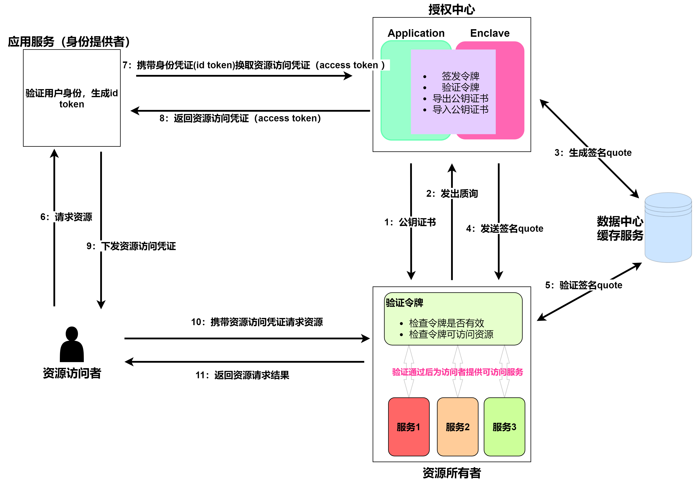

# 设计文档

<p align="center"><a href="./design%20document.md">English</a>|<a href="./design%20document.zh_CN.md">简体中文</a></p>

## 跨域授权流程




我们的项目是基于OIDC流程实施建立的，但是与普通的OIDC流程有所不同。在正常的OIDC流程中，Id Token、Access Token是一起下发的。但是在我们的场景中，身份认证和资源授权是跨域的，因此代表身份认证的Id Token和代表资源授权的Access Token是无法同时下发的。也就是说身份认证和资源服务是归属于不同公司或所有者的，但是他们之间是存在信任关系的。比如某公司有自有的身份认证系统，但是它购买了其他云服务厂商的云服务资源。现在某公司旗下的应用需要在公司已有的身份认证系统验证后去请求云服务厂商的资源。此时，我们可以在身份提供商处验证身份获得Id Token，然后拿取Id Token去到资源授权服务处获取Access Token，最后通过携带Access Token来访问资源服务。同时，为了保证授权中心的安全，项目将授权过程置于可信执行环境中进行，通过可信的硬件能力保证授权过程中的安全可靠。在授权验证阶段，验证服务会向授权服务申请包含公钥和远程证明Quote的jwk令牌，通过远程证明Quote中包含公钥哈希来形成对公钥的保护，借助远程证明来确保公钥的可信性，并最终使用公钥完成对资源权限的验证。

## 资源授权服务

在资源授权服务中，我们主要在TEE环境中做了密钥的初始化、远程证明对公钥的保护、并形成了两个api调用端口

### 密钥的初始化

项目在TEE中生成RSA密钥对，初始化过程中包含以下几个特性：

- 为确保授权中心可中断后再次启动，RSA密钥生成后会加密存储在指定文件中，应用初始化时会先读取密钥文件，当密钥可用时会直接使用密钥，不可使用时才会重新生成密钥
- 为进一步确保授权的安全性，密钥会隔一定的时间段进行刷新。当前默认刷新时间为90天

### 远程证明保护公钥

远程证明是一种机制，用于验证TEE内运行的代码和数据的完整性和安全性。通过远程证明机制，TEE可以在不暴露内部细节的情况下向远程服务器证明自身的安全性和可信度。这种机制可以帮助保护TEE内部的应用程序和数据免受潜在的攻击和威胁，并确保数据和代码的安全性和完整性。***在远程证明所需的Quote中存在64字节的可自定义字段，我们通过将公钥哈希值存储在自定义字段，借助远程证明形成对公钥的保护。***

#### 技术细节

1. 公钥哈希值的计算输入是诸如下面的json字符串

```python
# base64url_n: Base64 URL编码的n值
# base64url_e: Base64 URL编码的e值
"{{n: base64url_n, e: base64url_e}}"
```

2. 公钥的包装过程如下：

   1. 公钥哈希值插入Intel sgx远程证明Report data中

   2. Report 形成Quote

   3. Quote作为扩展字段形成x509公钥证书
   4. x509证书作为jwk令牌`x5c`的值
   5. 验证端通过jwk令牌获取公钥和远程证明Quote

   jwk示例：

   > 部分字段过长使用...代替

   ```json
   {"keys":
        [{
            "kty":"RSA",
            "use":"sig",
            "n":"...",
            "e":"AQAB",
            "kid":"OoU+j43OHVA540pflephjeckod/N8g/2ZvmKTNVnIqM=",
            "x5c":["..."],
            "alg": "RS256"}
        ]}
   }
   ```

### 两个api服务

#### Token转化接口

`https://127.0.0.1:8080/stsToken`

用于将Id Token转换为Access Token

##### 如何验证Id Token是合法有效的？

> - 资源授权服务会向身份提供商的jwks服务端口请求jwk令牌，通过jwk令牌验证Id Token是否合法有效
> - 本地配置文件会配置`idp`和`client_id`,会校验这两个字段在Id Token中是否匹配正确（在Id Token中client_id字段对应aud字段）

##### 如何将Id Token转换为Access Token?

> - 通过本地配置文件的配置规则来进行Token转换，服务会找到`idp`和`client_id`匹配的配置规则，并根据对应规则转换为Access Token
> - ***为了配置文件可以根据需要动态变化，配置文件是采用了对称加密的，只有管理员可以下发合法的配置问件，授权服务在解密后进行使用***

解密后的配置文件格式：

```json
{
	"configs": [
		{
			"idp": "https://dev-f3qm0elg4mvfgpsu.us.auth0.com/",
			"jwk_endpoint": "https://dev-f3qm0elg4mvfgpsu.us.auth0.com/.well-known/jwks.json",
			"client_id": "IMIprdP4qfSuKANevWkJyhG5F7weEGT0",
			"server_api": [
				"https://example.com/server1-api",
				"https://example.com/server2-api"
			],
			"scope": "openid profile read:admin",
			"expiration": 3600
		}
	]
}
```

转换示例：

```json
# 输入的Id Token解码后的HEADER和PAYLOAD:
# HEADER
{
  "alg": "RS256",
  "typ": "JWT",
  "kid": "bxM0D4dELsYy99nmjaNs5"
}
# PAYLOAD
{
  "iss": "https://dev-f3qm0elg4mvfgpsu.us.auth0.com/",
  "aud": "IMIprdP4qfSuKANevWkJyhG5F7weEGT0",
  "iat": 1695890776,
  "exp": 1695926776,
  "sub": "google-oauth2|107186323690826133746",
  "sid": "7WO37aWuQEMSQzBFTsHPQMekAPban8rI"
}

# 转换后的Access Token示例
# HEADER
{
  "typ": "JWT",
  "alg": "RS256",
  "kid": "OoU+j43OHVA540pflephjeckod/N8g/2ZvmKTNVnIqM="
}
# PAYLOAD
{
  "iss": "enclave authorization",
  "aud": [
    "https://example.com/server1-api",
    "https://example.com/server2-api"
  ],
  "sub": "google-oauth2|107186323690826133746",
  "iat": 1696053906,
  "exp": 1696057506,
  "scope": "openid profile read:admin",
  "client_id": "IMIprdP4qfSuKANevWkJyhG5F7weEGT0"
}
```

####  jwk令牌接口

`https://127.0.0.1:8080/.well-known/jwks.json`

提供授权中心的Jwk令牌

> jwk令牌中包含了签发Access Token私钥对应的公钥参数，同时包含了远程证明Quote，用于验证TEE环境的同时，验证公钥是可信的

## 资源授权验证

`https://127.0.0.1:9999/api`

资源授权验证端验证携带的Access Token的资源请求，并给予相应资源权限

### Access Token校验流程

1. 从jwk中的x509证书中提取Quote,校验Quote是否有效
2. Quote校验完成后，从Quote中提取公钥哈希值，并与jwk中提供的公钥参数sha256哈希值比较
3. 哈希值校验通过后，校验Access Token是否有效
4. 根据Access Token授予资源权限

